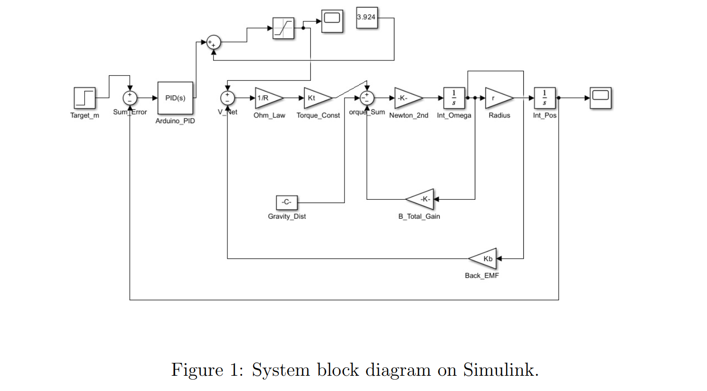

# Vertical Positioning Control System — Technical Case Study
**Control Systems Design | Closed-Loop Automation | MATLAB & Simulink | Embedded Firmware**

Welcome to the engineering documentation hub for the Vertical Positioning Control System. This repository showcases the full lifecycle of a multi-disciplinary mechatronics project—from analytical plant modeling and Simulink validation to physical hardware deployment and real-time microcontroller firmware execution.

## 🎥 System Operation Demo

*Real-time closed-loop tracking of a dynamic payload with an 8-second execution window.*

---

## 📄 Core Project Assets
* 🚀 **[Click Here to View the Full Technical Report](./Vertical_Positioning_Control_System_Technical_Report.pdf)**
* 💻 **[View Arduino Control Firmware Snippet](#embedded-software-implementation)**
* 📊 **[View MATLAB/Simulink Architecture](./simulink_model.png)**

---

## ⚙️ Core Engineering Achievements

### 1. Mechanical Architecture & Transmission Design
* **Mechanism:** Engineered a robust 4-sprocket chain-drive transmission system optimized for high-torque vertical displacement and load stability.
* **Feedback Optimization:** Integrated load-side rotary encoder feedback directly into the structural architecture, achieving precision telemetry by eliminating motor-side backlash and mechanical transmission hysteretic losses.

### 2. Control Systems & Simulation (MATLAB / Simulink)
* **Plant Modeling:** Derived continuous-time mathematical models and plant transfer functions accounting for structural mass, gravitational biases, friction, and torque-load variations.
* **Controller Tuning:** Designed and tuned a parallel PID controller configuration integrated with a high-bandwidth derivative filter and gravity feedforward bias.
* **Simulation Verification:** 
  *Simulink architecture validating the controller performance against simulated plant parameters, ensuring a 2-second settling window and zero steady-state error.*

### 3. Embedded Software Implementation
* **Firmware Architecture:** Developed real-time microcontroller logic tasked with high-speed sensor polling, error computation, and PWM actuation signal updates.
* **Control Loop Execution:**
  
  *Embedded implementation of the continuous discrete-time control loop processing feedback metrics to regulate motor velocity and vector position dynamically.*

---

## 📂 Repository Contents
* `Vertical_Positioning_Control_System_Technical_Report.pdf` — Comprehensive engineering blueprint containing formulas, schematics, and structural analysis.
* `operation_demo.gif` — 8-second visual proof of the physical system running under closed-loop command.
* `simulink_model.png` — Mathematical control block layout and transient verification loops.
* `arduino_code.png` — High-resolution layout of the deployed C/C++ control firmware script.
